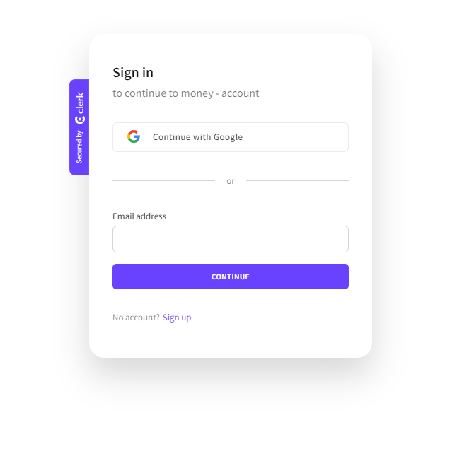
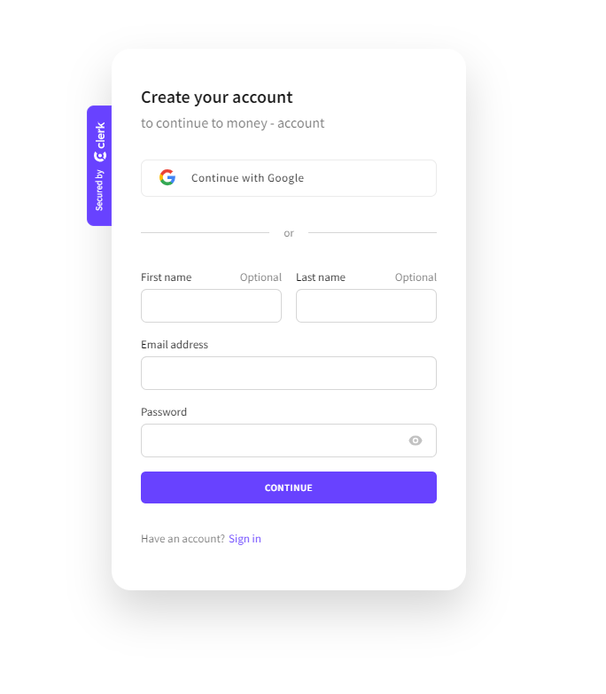
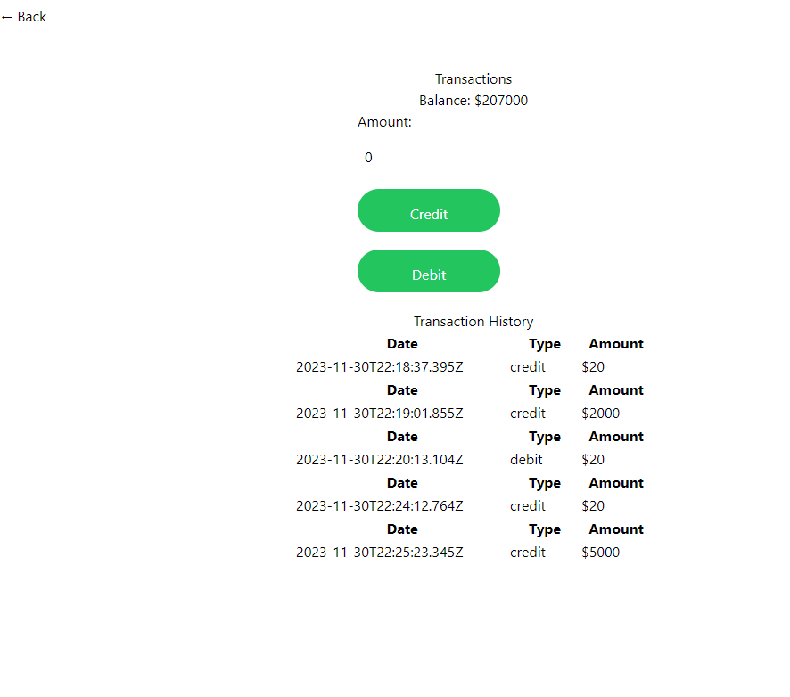
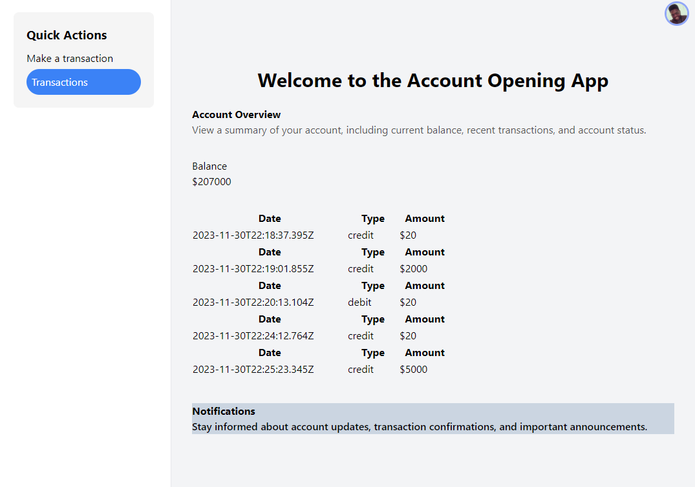

# Account Opening Application Development

eveloping a comprehensive account opening application using a technology stack of your choice. The application should cover all aspects, including database management, backend, and frontend development. Users should be able to create an account, log in, perform transactions (credit or debit), and modify their account information.

## Task Requirements

### 1. Account Creation
- Users must be able to create an account by providing necessary information such as name, email, and password.
- Implement input validation to ensure correctness and security of data.
 #### Approach
  - Used an external library called clerk which handled auth and auth details 
    providing me with email and phone number functionality.

    Sign-In
    

    Sign-Up
    

### 2. User Validation
- Upon creation, users should have a default status attribute set to "PENDING."
- Users go through two approval stages: one by the admin (status changes to     "VERIFIED") and another by Finance (status changes to "APPROVED").

### 3. Login System
- Implement a secure login system using JWT authentication.
- Users should be able to log in using their email and password.

### 4. Transaction Handling
- Enable users to perform transactions: credit (add money) or debit (withdraw money) from their account.
- Implement robust error handling for insufficient funds during debit transactions.

   ####Implemented this logic in the 

   

### 5. Account Information Modification
- Provide users with the ability to modify their account information, including changing passwords and updating email addresses.

 #### Approach

 - Clerk handled that for the project.
 

### 6. Backend Development
- Implement necessary backend logic to handle user requests, database interactions, and ensure data integrity.

### 7. Frontend Development
- Design a user-friendly interface that allows seamless interaction with the application.

#### Approach
  - Used tailwind and react
   

### 8. Database Integration
- Utilize a database system of your choice to securely store user account information.
- Implement an appropriate database schema and handle CRUD operations to maintain data consistency.
